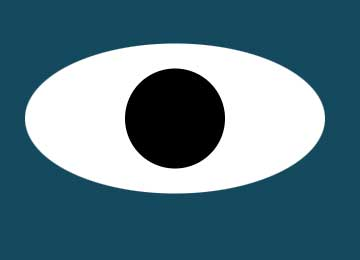

<h2> Here are the links to my first three projects:</h2>

  
  <a href="https://github.com/LarissaCoop/PacMen-Exercise ">&nbsp;&nbsp;&nbsp;&nbsp;&nbsp; PacMen Factory Game</a>
  
<strong>Description:</strong>This is a game where we press a button in the DOM to make a PacMan and they randomly move once the game is started.

<strong> How to run:  In essence you will download the files and same them in a folder.  You will open the folder in your text editor.  You will either fun 
  Live Server if using VS code or an open with command and select a browser.  In the case of PacMen, you will click on making a PacMan button 
  and then on the start button to watch the PacMen move.

<strong>Roadmap: I am thinking of adding in different creatures, including a Mrs. PacMan and Baby PacMen.  Update: I started making new creatures to use 
the logic of the PacMen game.

This portfolio and individual repository are covered under the MIT license.  Details of which 
can be found at this link.

<a href="https://choosealicense.com/licenses/mit/">MIT License</a>

 
 

  
  <a href="https://github.com/LarissaCoop/Eye-Exercise ">&nbsp;&nbsp;&nbsp;&nbsp;&nbsp; Rolling Eye Ball Project</a>

<strong>Description:This is a fun interactive set of eyeballs that follow the movement of the mouse on the screen.  This is an .onmoussemove JS event 
causing this effect.

<strong>Roadmap: I am thinking of adding in different creatures, including a tapeworm whose head will move with the mouse.

This portfolio and individual repository are covered under the MIT license.  Details of which 
can be found at this link.

<a href="https://choosealicense.com/licenses/mit/">MIT License</a>

 
 

  
  <a href="https://github.com/LarissaCoop/Real-Time-Bus-Tracker ">&nbsp;&nbsp;&nbsp;&nbsp;&nbsp; Real Time Bus Tracker</a>

<strong>Description: This app shows a marker of the bus moving and making stops between the Harvard and MIT campuses.

<strong>Roadmap: There is a possibility to expand this to additional bus lines.

This portfolio and individual repository are covered under the MIT license.  Details of which 
can be found at this link.

<a href="https://choosealicense.com/licenses/mit/">MIT License</a>
</body>
